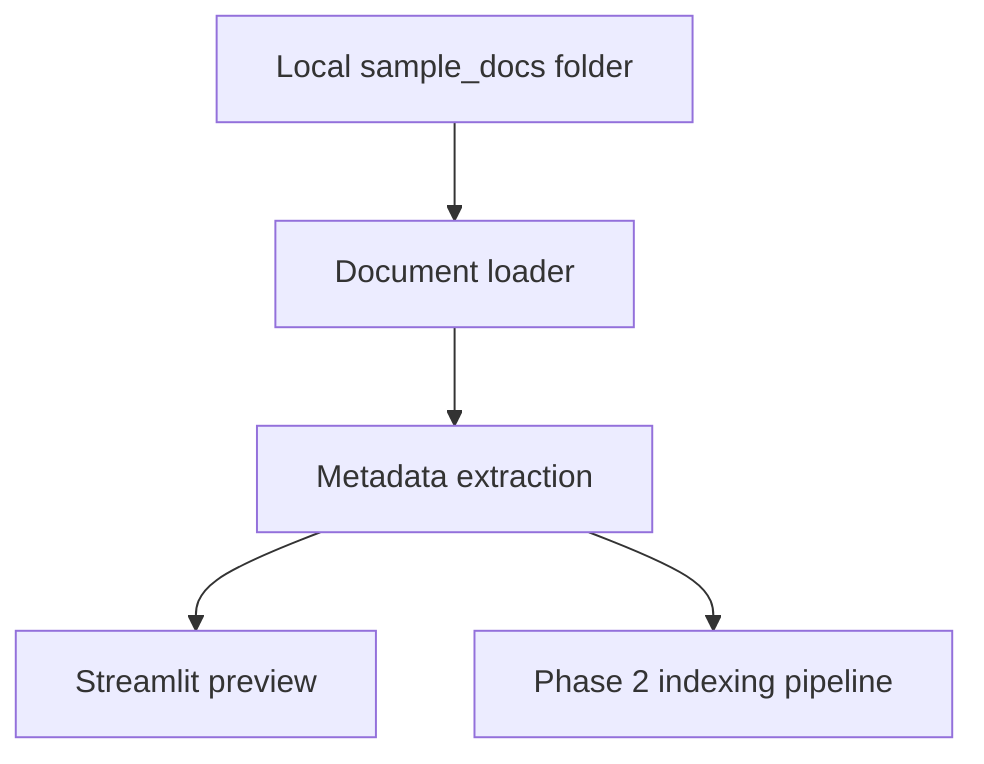

# Local OneDrive Knowledge Copilot

A local enterprise knowledge copilot prototype that simulates a SharePoint / OneDrive-based internal assistant with RAG, source citations, role-based retrieval filtering, and governance-aware guardrails.

This repository is currently implemented through Phase 2:

- Phase 0: project skeleton, configuration, sample documents, and README draft.
- Phase 1: document loading, path exclusions, metadata extraction, default role mapping, and a loaded document preview.
- Phase 2: document chunking, embedding generation, Qdrant local indexing, clear collection, and re-indexing.

## Why This Project

This is not a production replacement for Microsoft Copilot Studio or Microsoft 365 Copilot. It is a local prototype designed to demonstrate enterprise AI architecture awareness:

- Local folders map to SharePoint / OneDrive document libraries.
- Qdrant will map to Azure AI Search in later phases.
- Metadata-based role filtering maps to Entra ID group membership and SharePoint permission trimming.
- JSONL audit logs will map to Purview-style auditability.
- Source-grounded answers and citations reduce hallucination risk.

## Current Architecture



## Implemented Features

- Recursively scans `.pdf`, `.md`, `.txt`, and `.docx` documents.
- Excludes `.git`, `.venv`, `node_modules`, `__pycache__`, `.qdrant`, cache folders, and temporary files.
- Extracts stable metadata including source path, relative path, file type, modified time, checksum, department, sensitivity, and allowed roles.
- Infers document department and access roles from the first folder under the document root.
- Provides a Streamlit preview table for loaded documents.
- Includes sample documents for general, project, finance, and HR scenarios.
- Converts loaded documents into LlamaIndex `Document` objects with enterprise metadata.
- Uses LlamaIndex `SentenceSplitter` for metadata-preserving chunking.
- Uses LlamaIndex embedding and Qdrant integrations for production-like ingestion.
- Stores vectors and payload metadata in a local Qdrant collection.
- Supports clearing and rebuilding the index from the Streamlit sidebar or CLI.

## Role-Based Retrieval Filtering

Phase 1 stores role metadata so Phase 2 and Phase 3 can apply permission filtering before generation.

| Folder | Default allowed roles |
|---|---|
| `general/` | `general_staff`, `project_manager`, `finance`, `hr`, `admin` |
| `projects/` | `project_manager`, `admin` |
| `finance/` | `finance`, `admin` |
| `hr/` | `hr`, `admin` |

The important design principle is that restricted chunks must be filtered before they are passed to the LLM.

## Setup

```bash
cd local-onedrive-knowledge-copilot
python -m venv .venv
source .venv/bin/activate
pip install -r requirements.txt
cp .env.example .env
```

## Preview Loaded Documents

Use the CLI preview:

```bash
python -m src.loaders --root data/sample_docs
```

Or run the Streamlit app:

```bash
streamlit run app.py
```

Then click `Load document preview`.

## Index Documents

Use the Streamlit sidebar button:

```text
Re-index documents
```

Or run the CLI:

```bash
python -m src.indexing --root data/sample_docs --clear
```

The default ingestion path uses LlamaIndex with:

- `SentenceSplitter` for chunking
- `HuggingFaceEmbedding` for local sentence-transformers models
- `QdrantVectorStore` for vector DB writes

The default embedding model is:

```text
sentence-transformers/all-MiniLM-L6-v2
```

The first run may download the model if it is not already cached. In a no-network environment, set `EMBEDDING_MODEL` to a local Hugging Face model path.

Local Qdrant storage is written to:

```text
.qdrant/
```

## Configuration

The `.env.example` file includes placeholders for later phases:

- LLM provider and model settings.
- Embedding provider and model settings.
- Qdrant collection settings.
- Local Qdrant path for embedded storage.
- Chunking, retrieval, and audit log settings.

## Planned RAG Pipeline

1. Load documents from a local OneDrive-like folder.
2. Extract metadata and default allowed roles.
3. Chunk documents with LlamaIndex `SentenceSplitter` while preserving metadata. Implemented in Phase 2.
4. Embed chunks with LlamaIndex embedding integrations. Implemented in Phase 2.
5. Store vectors and metadata in Qdrant through `QdrantVectorStore`. Implemented in Phase 2.
6. Receive user query and selected role.
7. Retrieve chunks with role-based permission filtering.
8. Generate a grounded answer using retrieved context only.
9. Show citations and source snippets.
10. Write audit records.

## Security and Governance Roadmap

Later phases will add:

- Prompt injection detection in user queries and retrieved context.
- Sensitive data warnings for emails, phone numbers, tokens, secrets, and password-like content.
- Refusal behavior when evidence is missing or permission-filtered documents are unavailable.
- JSONL audit logging with role, query, warnings, source files, scores, and answer status.

## Limitations

- No real Microsoft Graph, SharePoint, OneDrive, Entra ID, Teams, or Purview integration yet.
- No retrieval, LLM generation, or audit logging yet.
- Role selection is local and simulated.
- Current permissions are inferred from folder names, not synced from real ACLs.

## Future Work

- Phase 3: permission-aware retrieval and source-grounded answer generation.
- Phase 4: complete Streamlit chat UI with sources and warnings.
- Phase 5: guardrails, audit logs, refusal behavior, and minimal tests.
- Phase 6: architecture docs, security docs, demo script, and portfolio polish.
