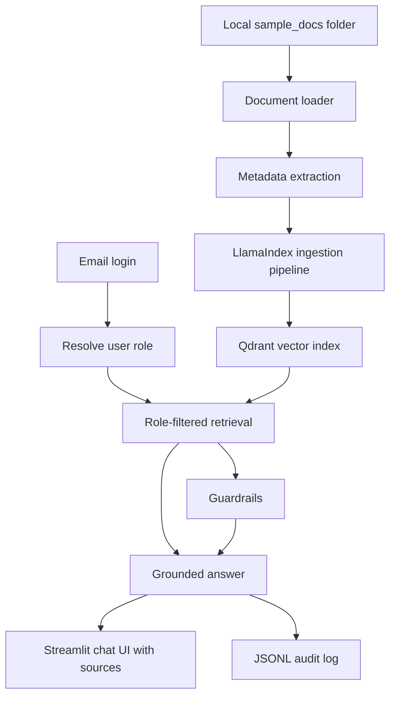
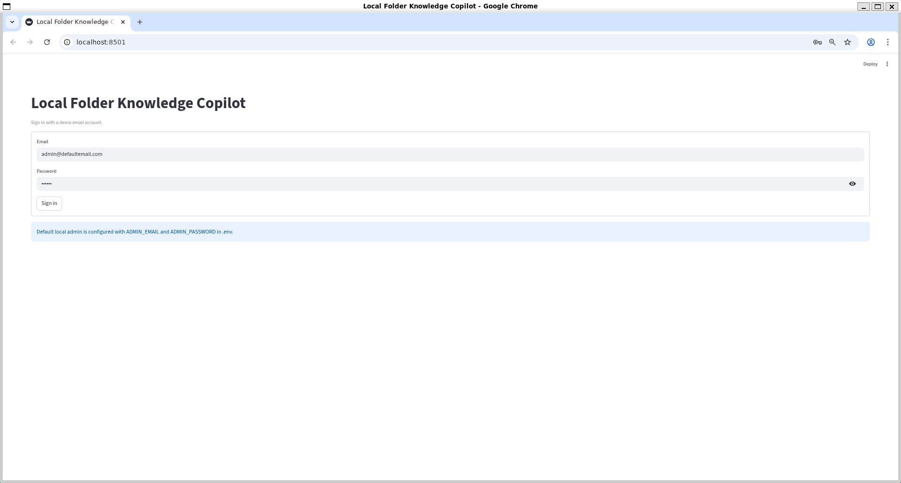
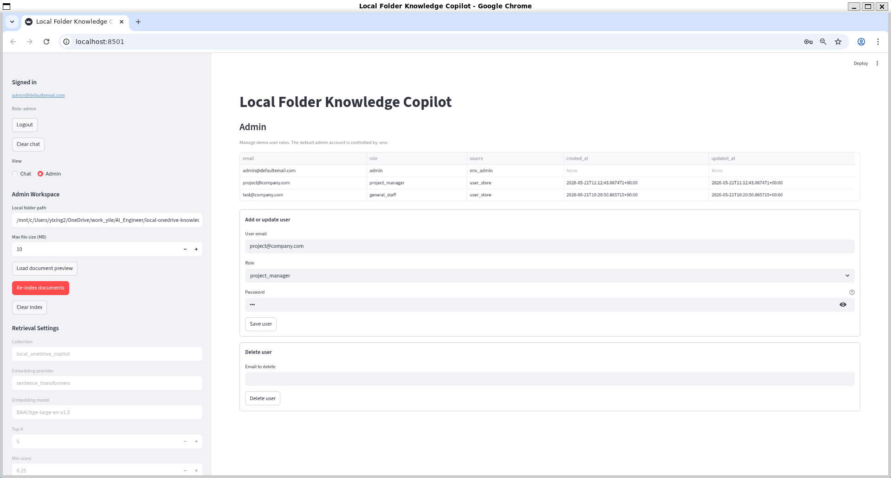
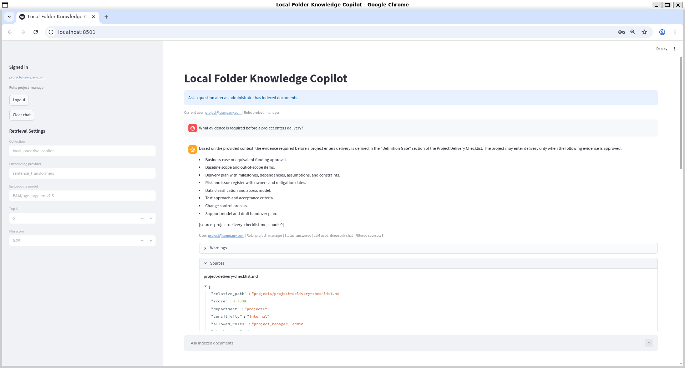

# Local Folder Knowledge Copilot

A local file-folder based knowledge copilot prototype with RAG, source citations, role-based retrieval filtering, administrator-managed users, and governance-aware guardrails.

## Why This Project

This is not a production replacement for Microsoft Copilot Studio or Microsoft 365 Copilot. It is a local prototype for exploring enterprise RAG patterns:

- Local folders can map to SharePoint / OneDrive document libraries in an enterprise deployment.
- Qdrant maps to Azure AI Search in an enterprise deployment.
- Email-based role assignment maps to Entra ID group membership and SharePoint permission trimming.
- JSONL audit logs will map to Purview-style auditability.
- Source-grounded answers and citations reduce hallucination risk.

## Current Architecture



## Implemented Features

- Recursively scans `.pdf`, `.md`, `.txt`, and `.docx` documents.
- Excludes `.git`, `.venv`, `node_modules`, `__pycache__`, `.qdrant`, cache folders, and temporary files.
- Extracts stable metadata including source path, relative path, file type, modified time, checksum, department, sensitivity, and allowed roles.
- Infers document department and access roles from the first folder under the document root.
- Provides a Streamlit preview table for loaded documents.
- Includes sample documents for general, project, finance, and HR scenarios.
- Converts loaded documents into LlamaIndex `Document` objects with enterprise metadata.
- Uses LlamaIndex `SentenceSplitter` for metadata-preserving chunking.
- Uses LlamaIndex embedding and Qdrant integrations for production-like ingestion.
- Stores vectors and payload metadata in a local Qdrant collection.
- Supports clearing and rebuilding the index from the Streamlit sidebar or CLI.
- Provides a local email/password login flow for demo users.
- Lets the default administrator add, update, and delete user email-to-role mappings.
- Retrieves chunks with a Qdrant metadata filter based on the authenticated user's role.
- Refuses when no accessible evidence is found.
- Generates a grounded answer from retrieved sources, using an OpenAI-compatible LLM when configured or a local extractive fallback otherwise.
- Provides a chat-style Streamlit interface with message history, per-answer status, and source expanders.
- Displays prompt-injection and sensitive-data warnings for user queries and retrieved context.
- Writes one JSONL audit event for each answer and shows recent audit events in the sidebar.

## Enterprise Mapping

| Prototype component | Enterprise equivalent |
|---|---|
| Streamlit app | Teams app, internal web app, or Copilot Studio agent front end |
| Local folder | SharePoint or OneDrive document libraries |
| Folder-derived metadata | SharePoint metadata, ACLs, and sensitivity labels |
| Local email/password login | Entra ID authentication and group membership |
| Local user store | Directory-backed role or group assignment |
| Qdrant local vector index | Azure AI Search vector index with security trimming |
| OpenAI-compatible chat API | Azure OpenAI chat deployment |
| Local JSONL audit log | Purview, Azure Monitor, Application Insights, or SIEM telemetry |

## Role-Based Retrieval Filtering

Documents store role metadata so retrieval can apply permission filtering before generation.

| Folder | Default allowed roles |
|---|---|
| `general/` | `general_staff`, `project_manager`, `finance`, `hr`, `admin` |
| `projects/` | `project_manager`, `admin` |
| `finance/` | `finance`, `admin` |
| `hr/` | `hr`, `admin` |

The administrator assigns each demo email to an application role. The important design principle is that restricted chunks must be filtered before they are passed to the LLM.

## Setup

```bash
cd local-folder-knowledge-copilot
python -m venv .venv
source .venv/bin/activate
pip install -r requirements.txt
cp .env.example .env
```

The default local administrator is configured in `.env`:

```text
ADMIN_EMAIL=admin@defaultemail.com
ADMIN_PASSWORD=local-admin-password
```

This is a local demo login. In production, it should be replaced with Entra ID / SSO.

## Run The App

```bash
streamlit run app.py
```

Sign in with the configured default administrator, then use the sidebar to preview documents, manage users, and build the index.



## Preview Loaded Documents

Use the CLI preview:

```bash
python -m src.loaders --root data/sample_docs
```

Or sign in as an administrator and click `Load document preview`.

## Index Documents

Use the administrator sidebar button:

```text
Re-index documents
```

Or run the CLI:

```bash
python -m src.indexing --root data/sample_docs --clear
```

The default ingestion path uses LlamaIndex with:

- `SentenceSplitter` for chunking
- `HuggingFaceEmbedding` for local sentence-transformers models
- `QdrantVectorStore` for vector DB writes

The default embedding model is:

```text
BAAI/bge-large-en-v1.5
```

The first run may download the model if it is not already cached. In a no-network environment, set `EMBEDDING_MODEL` to a local Hugging Face model path.

Local Qdrant storage is written to:

```text
.qdrant/
```

## Manage Users

The default administrator can create local demo users and assign one application role per email:

- `general_staff`
- `project_manager`
- `finance`
- `hr`
- `admin`

The local user store is written to:

```text
data/app_state/users.json
```

This file is ignored by Git because it can contain local demo accounts.



## Ask Questions

After signing in and indexing, use the Streamlit chat input:

```text
Ask indexed documents
```

Retrieval applies the authenticated user's role before answer generation. For example:

- `finance` and `admin` can retrieve `finance/` documents.
- `general_staff` cannot retrieve `finance/`, `hr/`, or `projects/` documents.

If no LLM settings are configured, the app returns an extractive grounded answer from accessible source chunks. To use an OpenAI-compatible chat API, configure:

```text
LLM_PROVIDER=openai_compatible
LLM_BASE_URL=
LLM_API_KEY=
LLM_MODEL=
```

Warnings appear below an assistant answer when guardrails detect prompt-injection phrases or basic sensitive-data patterns.

Recent audit events appear in the sidebar under:

```text
Audit log preview
```



## Configuration

The `.env.example` file includes runtime settings for:

- LLM provider and model settings.
- Embedding provider and model settings.
- Qdrant collection settings.
- Local Qdrant path for embedded storage.
- Chunking, retrieval, and audit log settings.
- Default administrator and local user-store settings.

## RAG Pipeline

1. Load documents from a local folder.
2. Extract metadata and default allowed roles.
3. Chunk documents with LlamaIndex `SentenceSplitter` while preserving metadata.
4. Embed chunks with LlamaIndex embedding integrations.
5. Store vectors and metadata in Qdrant through `QdrantVectorStore`.
6. Receive user query and resolve the authenticated user's role.
7. Retrieve chunks with role-based permission filtering.
8. Generate a grounded answer using retrieved context only.
9. Show citations and source snippets.
10. Write audit records.

## Example Questions

After signing in and indexing `data/sample_docs`, try:

| User role | Question | Expected behavior |
|---|---|---|
| `finance` | `When are non-PO invoices allowed?` | Retrieves finance chunks and answers from `vendor-payment-process.md`. |
| `general_staff` | `When are non-PO invoices allowed?` | Does not retrieve finance chunks because of role filtering. |
| `project_manager` | `What evidence is required before a project enters delivery?` | Retrieves project delivery evidence. |
| `hr` | `What documentation may HR request for absences longer than three consecutive workdays?` | Retrieves HR leave policy evidence. |
| `finance` | `What is suspicious about the vendor note?` | Retrieves the suspicious vendor note and shows prompt-injection warnings. |

## Security And Governance

Current controls include:

- Prompt injection detection in user queries and retrieved context.
- Sensitive data warnings for emails, phone numbers, tokens, secrets, and password-like content.
- JSONL audit logging with role, query, warnings, source files, scores, and answer status.

## Limitations

- No real Microsoft Graph, SharePoint, OneDrive, Entra ID, Teams, or Purview integration yet.
- Login is local and simulated; it is not a production authentication system.
- Current permissions are inferred from folder names, not synced from real ACLs.
- Guardrails are pattern-based and not a complete DLP or prompt-security system.

## Future Work

- Add hybrid retrieval and reranking for acronyms, short queries, and exact policy terms.
- Replace simulated folder permissions with real ACL sync.
- Replace local demo login with Entra ID / SSO.
- Add automated evaluation for retrieval recall, groundedness, hallucination, and oversharing.
- Add blocking policies for high-risk guardrail warnings.
